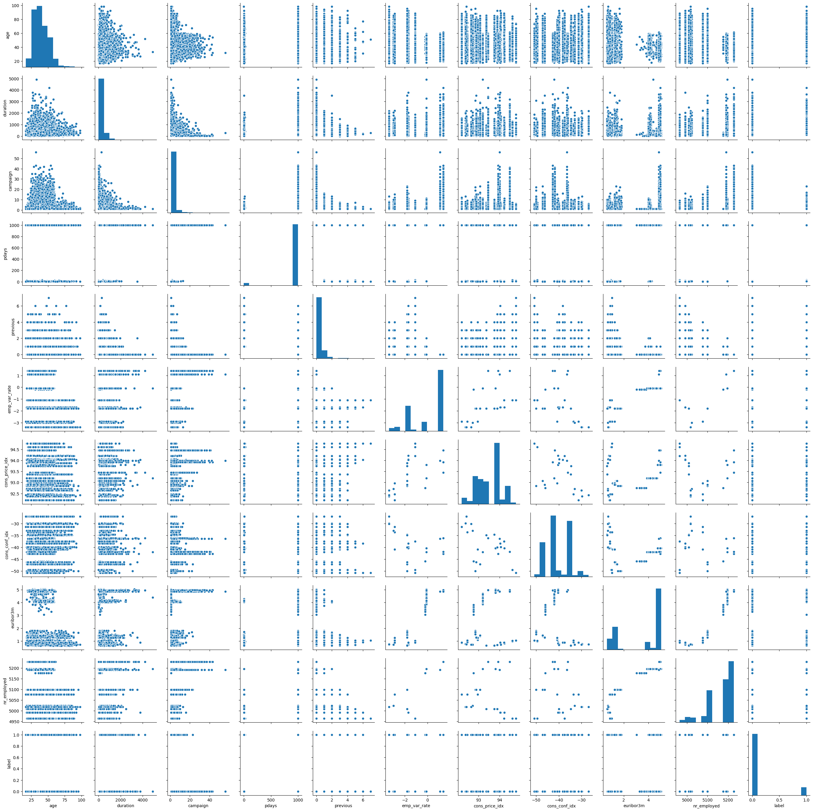
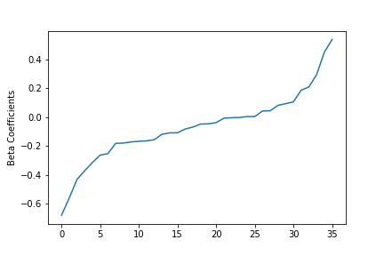
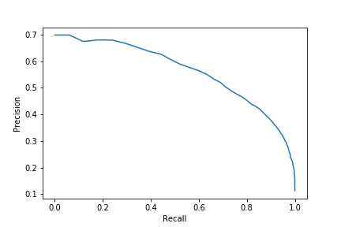

# Binary Classification Problem
Solving a binary classification problem using MLlib and PySpark

## Goal
The goal is to build a binary classifier in a direct marketing campaign (phone calls) of a bank. The classification should predict whether a client will subsribe to a deposit or not. 

## Dataset
The dataset is from [UCI Machine Learning](http://archive.ics.uci.edu/ml/index.php) and can be downloaded [here](https://raw.githubusercontent.com/madmashup/targeted-marketing-predictive-engine/master/banking.csv)

Statistical properties of numerical variables in dataset:

<table border="1" class="dataframe">
  <thead>
    <tr style="text-align: right;">
      <th></th>
      <th>0</th>
      <th>1</th>
      <th>2</th>
      <th>3</th>
      <th>4</th>
    </tr>
  </thead>
  <tbody>
    <tr>
      <td>summary</td>
      <td>count</td>
      <td>mean</td>
      <td>stddev</td>
      <td>min</td>
      <td>max</td>
    </tr>
    <tr>
      <td>age</td>
      <td>41188</td>
      <td>40.02406040594348</td>
      <td>10.421249980934071</td>
      <td>17</td>
      <td>98</td>
    </tr>
    <tr>
      <td>duration</td>
      <td>41188</td>
      <td>258.2850101971448</td>
      <td>259.2792488364657</td>
      <td>0</td>
      <td>4918</td>
    </tr>
    <tr>
      <td>campaign</td>
      <td>41188</td>
      <td>2.567592502670681</td>
      <td>2.7700135429023445</td>
      <td>1</td>
      <td>56</td>
    </tr>
    <tr>
      <td>pdays</td>
      <td>41188</td>
      <td>962.4754540157328</td>
      <td>186.91090734474153</td>
      <td>0</td>
      <td>999</td>
    </tr>
    <tr>
      <td>previous</td>
      <td>41188</td>
      <td>0.17296299893172767</td>
      <td>0.49490107983929027</td>
      <td>0</td>
      <td>7</td>
    </tr>
    <tr>
      <td>emp_var_rate</td>
      <td>41188</td>
      <td>0.0818855006312578</td>
      <td>1.5709597405170233</td>
      <td>-3.4</td>
      <td>1.4</td>
    </tr>
    <tr>
      <td>cons_price_idx</td>
      <td>41188</td>
      <td>93.57566436827008</td>
      <td>0.5788400489541244</td>
      <td>92.201</td>
      <td>94.767</td>
    </tr>
    <tr>
      <td>cons_conf_idx</td>
      <td>41188</td>
      <td>-40.50260027192037</td>
      <td>4.628197856174547</td>
      <td>-50.8</td>
      <td>-26.9</td>
    </tr>
    <tr>
      <td>euribor3m</td>
      <td>41188</td>
      <td>3.621290812858366</td>
      <td>1.734447404851269</td>
      <td>0.634</td>
      <td>5.045</td>
    </tr>
    <tr>
      <td>nr_employed</td>
      <td>41188</td>
      <td>5167.035910943202</td>
      <td>72.25152766826123</td>
      <td>4963.6</td>
      <td>5228.1</td>
    </tr>
    <tr>
      <td>label</td>
      <td>41188</td>
      <td>0.11265417111780131</td>
      <td>0.3161734269429653</td>
      <td>0</td>
      <td>1</td>
    </tr>
  </tbody>
</table>

## Approach
1. Screen and Prepare Data
2. Build Pipeline
3. Use Logisitc Regression Model
4. Use Decision Tree Classifier
5. Use Random Forest
6. Use Gradient-Boosted Tree
7. Perform grid search for parameter optimization

## Conclusion

The variables in the dataset do not significantly correlate, which is why I decided to keep most of them for the model. 

For the categorical features (i.e. job, martial, education, housing, etc.), a string indexer together with an appropriate encoder have been used. The Encoder transofrms the categorical features into vectors for further processing. 

Together with the numeric features, all the relevant variables have been transformed into a feature vector using a vector assembler. 

The following graph shows the coefficients of the linear regression performed on the resulting features:

The precision/recall curve for the logistic regression model is shown in the following graph:

Using the same pipeline, different tree-based models have been tries (decision tree, random forest, gradient-boosted). The gradient-boosted tree has beformed best with a AUROC of approx. 0.931 on the given test set. 

In order to optimize/tune the parameters used, a parameter grid has been built and different trees have been trained and evaluated using a cross validator. 
The AUROC could slightly be improved to 0.935 which is not really significant. 

Overall, the gradient-boosted tree has performed best, directly followed by the logistic regression.

